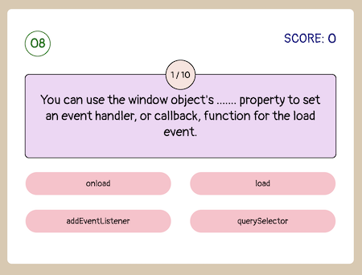

# Online Quiz

## Preview
  

## Description
Welcome to my first online quiz built by using mainly JavaScript. 

## Deployed Application
https://roukell.github.io/online_quiz/

## Technologies used
HTML, CSS, JavaScript

## Instruction
1. Click [here](https://roukell.github.io/online_quiz/) to start the quiz.
2. There are 10 questions in total related to HTML CSS and Javascript (not so much about CSS).
3. You have 15 seconds for each question, once you clicked on an answer time will stop for that question. And correct answer will show in a description box. 
4. Your result will be generated after all 10 questions are completed.
5. Welcome to redo the quiz after finishing.
6. To view your record in local storage, please reload/refresh the page, and you will see if at the end of the quiz.

## Questions
If you have any questions, feel free to contact me via email: yiling.melody.lo@gmail.com  
My GitHub profile: https://github.com/roukell

